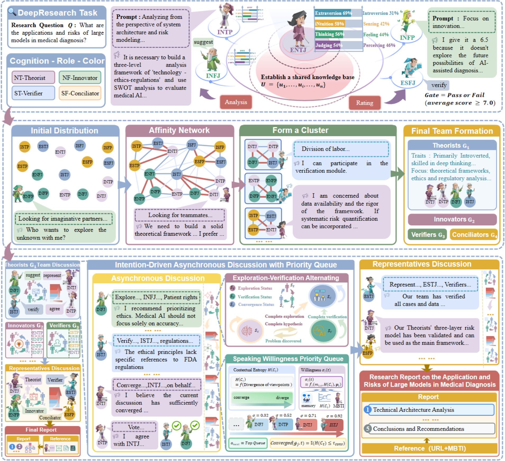

# DyCo

[](PAPER_URL_TODO) [](LICENSE) [](https://www.python.org/)

**DyCo (Dynamic Cognitive Role Coordination)** is a framework for open-ended, literature-grounded multi-agent research synthesis and verification. It combines structured role priors, dynamic teaming, willingness-driven asynchronous discussion, and **Exploration--Verification Alternation (EVA)**.

> **Important scope note.** MBTI is used only as an interpretable, controllable role-prior testbed in this project. DyCo does not claim that language models have human personality traits, nor does it make a psychometric claim about MBTI.

**Paper:** *DyCo: Dynamic Cognitive Role Coordination for Open-Ended Multi-Agent Research Synthesis and Verification* (EMNLP 2026 Findings; paper link: `PAPER_URL_TODO`).
**Authors:** Zhiyu Zhang, Leheng Wu, Yijun Mo, Mingchu Zhong, Yulin Zhang, and Chen Xi.

[中文说明](README_zh.md)

## Overview



DyCo organizes agents around four functional cognitive quadrants:

- **NT / Theorist:** abstract frameworks and strategic analysis;
- **NF / Innovator:** hypothesis generation and pattern discovery;
- **ST / Verifier:** concrete evidence checking and critical validation;
- **SF / Mediator:** synthesis, conflict resolution, and team coordination.

The framework has four main stages:

1. **Initial analysis:** agents independently inspect the research question and propose directions.
2. **Dynamic teaming:** an affinity network is used to form task-oriented sub-teams.
3. **Intention-driven discussion:** agents join an asynchronous priority queue according to contextual willingness.
4. **Representative negotiation:** team representatives reconcile findings and produce the final report.

EVA alternates between exploration and verification so that promising hypotheses are repeatedly challenged before synthesis.

## Results reported in the paper

RACE scores on DeepResearch Bench (`mean ± std`, 10 independent runs; higher is better):

| Method | Overall RACE |
| --- | ---: |
| SingleAgent | 37.80 ± 0.38 |
| ToTAgent | 40.62 ± 0.42 |
| MetaGPT | 39.72 ± 0.49 |
| AutoGen | 40.43 ± 0.47 |
| CrewAI | 40.88 ± 0.45 |
| 4×INFJ | 42.53 ± 0.30 |
| **DyCo-Diverse** | **42.75 ± 0.31** |

The main diverse configuration is **ENTJ + INTJ + ESTP + ISFJ**. It improves over CrewAI by 4.6% in the reported setting. Matched controls indicate that most of the gain is explained by rich, behaviorally specific role priors and verification-oriented coordination rather than by MBTI semantics alone. The difference between DyCo-Diverse and the strongest homogeneous configuration (4×INFJ) is not statistically significant in the paper.

The paper also reports **DyCo-Efficient**, which removes dynamic teaming and preserves most of the quality at approximately one thirteenth of the token cost. Use Full DyCo only when its additional compute is justified.

## Repository status and data

This repository contains the core framework, prompts, configuration templates, and evaluation entry point. The DeepResearch Bench data and generated reports are **not redistributed** here. Obtain the benchmark from its official source and follow its license and usage terms.

The following details still need to be filled in before the camera-ready release page is published:

- paper / ACL Anthology URL: `PAPER_URL_TODO`;
- repository URL: `REPOSITORY_URL_TODO`;
- exact benchmark commit or release: `DATASET_VERSION_TODO`;
- task-sampling seed and complete run-seed list: `SEEDS_TODO`;
- artifact DOI (if a separate code release is archived): `CODE_DOI_TODO`.

## Installation

Requires Python 3.10 or newer. A lightweight runtime dependency list is provided in `requirements.txt`; the original development environment snapshot is retained as `requirements-full.txt`.

```bash
git clone REPOSITORY_URL_TODO
cd DyCo
python -m venv .venv

# Linux/macOS
source .venv/bin/activate
# Windows PowerShell: .venv\\Scripts\\Activate.ps1

python -m pip install --upgrade pip
pip install -r requirements.txt
```

If `faiss-cpu` is not available for your platform, install a compatible FAISS build separately and keep the remaining dependencies from `requirements.txt`.

## Configuration

```bash
cp .env.example .env
```

On Windows PowerShell, use `Copy-Item .env.example .env` instead. Fill in:

- `OPENAI_API_KEY` and `OPENAI_BASE_URL` for the OpenAI-compatible generation endpoint;
- `OPENAI_EMBEDDING_API_KEY` and `OPENAI_EMBEDDING_MODEL_URL` for embeddings;
- `JINA_API_KEY` for the Jina retrieval service.

The `api_key` and `model_url` values in `configs/system.yaml` are **environment-variable names**, not secret values. Never commit `.env` or real API keys. The default paper configuration uses `gpt-4o-mini-2024-07-18`, temperature `0.7`, `text-embedding-3-small`, and Jina top-5 retrieval. You may use another OpenAI-compatible provider by changing the endpoint and model fields, but results will not be directly comparable to the paper.

## Quick start: one task

The following example runs the default DyCo-Diverse team. It makes external model, embedding, and retrieval calls and therefore incurs provider costs.

```python
from src.workflows.mbtiagentsystem import MBTIAgentSystem

system = MBTIAgentSystem(
    config_dir="configs",
    agent_ids=["entj_001", "intj_001", "estp_001", "isfj_001"],
)
result = system.solve_task(
    "What are the applications and risks of large language models in medical diagnosis?"
)

if result["success"]:
    print(result["final_answer"])
else:
    raise RuntimeError(result.get("error_message", "DyCo failed"))
```

Runtime artifacts (messages, logs, and task-specific knowledge stores) are written under `workspace/`, which is ignored by Git.

## Testing

The repository includes configuration smoke tests that do not call external services:

```bash
python -m pytest -q tests
```

To check syntax for the complete local tree:

```bash
python -m compileall -q src configs evaluate tests
```

## Reproducing benchmark generation

After obtaining the official benchmark files, place or reference its `query.jsonl` and run:

```bash
python evaluate/ours/generate_mbti_responses.py \\
  --query_file /path/to/query.jsonl \\
  --output_dir workspace/evaluation/dyco-diverse \\
  --agent_ids entj_001 intj_001 estp_001 isfj_001 \\
  --limit 1
```

Remove `--limit 1` to process the selected input set. Add `--resume` to skip queries whose output metadata already exists, or use `--query_ids 1 15 16` for selected tasks. The script writes HTML, JSON metadata, and plain-text reports to the output directory.

### Paper configurations

The default team in `configs/system.yaml` is the paper's DyCo-Diverse configuration:

```text
ENTJ + INTJ + ESTP + ISFJ
```

For the strongest homogeneous comparison, pass the same ID four times:

```bash
python evaluate/ours/generate_mbti_responses.py \\
  --query_file /path/to/query.jsonl \\
  --output_dir workspace/evaluation/4x-infj \\
  --agent_ids infj_001 infj_001 infj_001 infj_001
```

All 16 role configurations are available under `configs/agents/`. To change the default team, edit the `agents` list in `configs/system.yaml`. See [configs/README.md](configs/README.md) for the schema and paper-to-configuration mapping.

## Project layout

```text
configs/                 YAML configuration loader and example configurations
src/agents/               Base agent and 16 MBTI role implementations
src/communication/        Messages, speaking queue, and team management
src/prompts/              Role and function prompt templates
src/tools/                Knowledge management and web-search tools
src/utils/                LLM client, parsing, and discussion summarization
src/workflows/            Four-round DyCo workflow and system entry point
evaluate/ours/            Benchmark response-generation script
figures/                  Release figures used by the documentation
```

## Experimental details

The reported main experiment uses GPT-4o-mini (`gpt-4o-mini-2024-07-18`) at temperature 0.7, Jina web search with up to five passages per query, a maximum of eight within-team discussion rounds, and up to five representative-level rounds. DeepResearch Bench is sampled across 22 domains; after deduplication, 100 tasks are split into 50 development and 50 evaluation tasks, and the main numbers are reported on the held-out evaluation set. Unless otherwise noted, `n=10` means ten independent full-benchmark runs.

RACE measures Comprehensiveness, Insight, Instruction Following, and Readability. It does not directly measure factual correctness or citation faithfulness, so the paper reports a blinded human evaluation and a small pilot factuality/source-faithfulness audit as complementary evidence. Do not interpret the automatic score as a guarantee of factual reliability.

## Limitations and responsible use

- Outputs depend on the selected model, prompts, retrieval availability, and web content at run time.
- The system can produce plausible but unsupported statements and should be checked against primary sources.
- Do not use generated reports as the sole basis for medical, legal, financial, safety-critical, or other high-stakes decisions.
- Respect the terms of the model provider, Jina, and DeepResearch Bench, and avoid submitting private or sensitive data to external services.

## Citation

If you use DyCo, please cite the paper. Replace the placeholders in [CITATION.cff](CITATION.cff) once the official ACL Anthology record and repository URL are available.

```bibtex
@inproceedings{zhang2026dyco,
  title     = {DyCo: Dynamic Cognitive Role Coordination for Open-Ended Multi-Agent Research Synthesis and Verification},
  author    = {Zhang, Zhiyu and Wu, Leheng and Mo, Yijun and Zhong, Mingchu and Zhang, Yulin and Xi, Chen},
  booktitle = {Findings of the 2026 Conference on Empirical Methods in Natural Language Processing},
  year      = {2026},
  publisher = {Association for Computational Linguistics},
  url       = {PAPER_URL_TODO},
  doi       = {PAPER_DOI_TODO}
}
```

## License

The source code is released under the [MIT License](LICENSE). Third-party datasets, APIs, model outputs, and prompt-derived materials remain subject to their respective terms.

## Contributing

Please see [CONTRIBUTING.md](CONTRIBUTING.md) for development setup, issue reports, pull requests, and reproducibility expectations.
